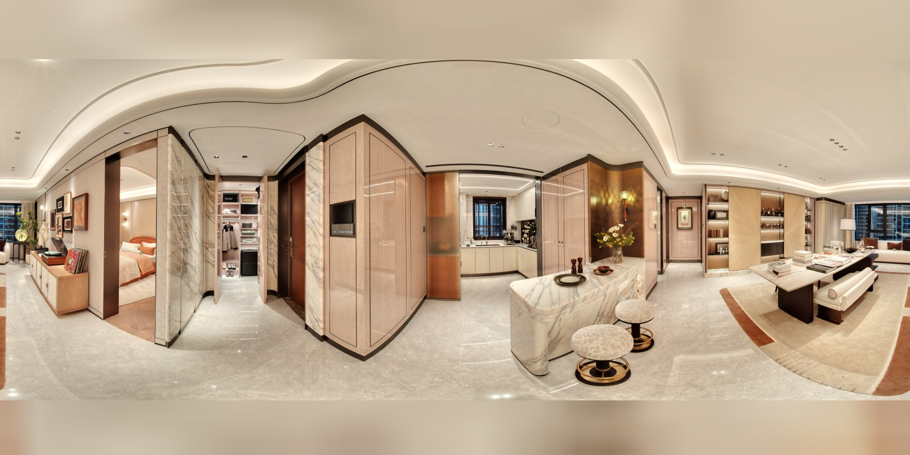
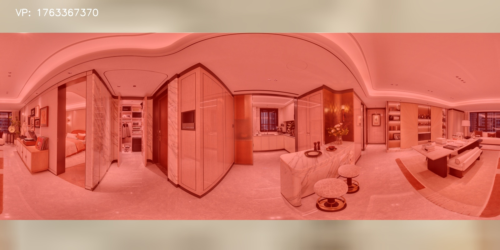
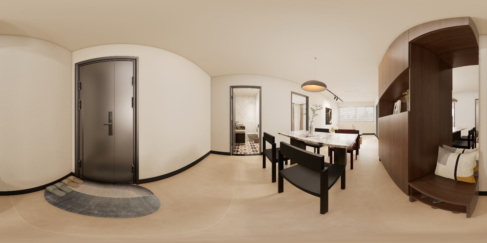
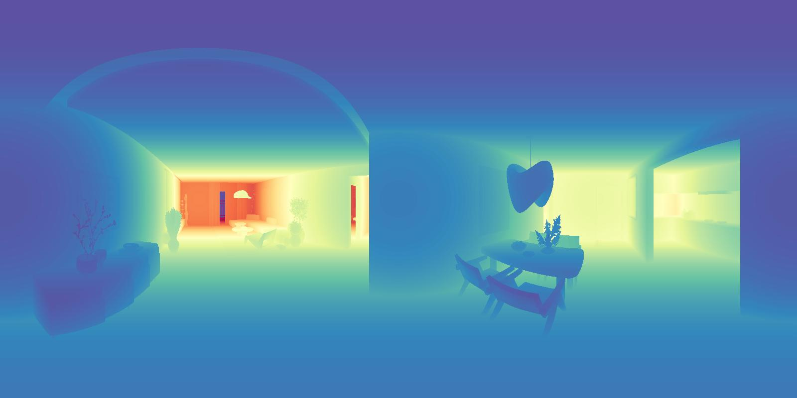

# 📂 Dataset Structure

The Realsee3D dataset adheres to a hierarchical file organization centered around unique scene identifiers. Each scene directory encapsulates the complete multi-view RGB-D data, comprising a registry of available viewpoints and a structured subdirectory containing sensor data and annotations for each distinct viewpoint.

## File Hierarchy

```text
scene_id/
├── viewpoints.txt       # Registry of all viewpoint IDs (timestamps) within the scene.
└── viewpoints/
    └── viewpoint_id/    # Container for specific viewpoint data.
        ├── panoImage_1600.jpg  # Equirectangular RGB Panorama (typically 1600x800).
        ├── depth_image.png     # 16-bit aligned relative depth map.
        ├── pano_mask.png       # [Real-world only] Validity mask indicating FOV blind spots.
        ├── extrinsics.txt      # 4x4 Camera-to-World transformation matrix.
        ├── depth_scale.txt     # Normalization factor for metric depth recovery.
        └── floor.txt           # Floor level index for multi-story environments.
```

## 1. Visual Representations

### RGB Panorama (`panoImage_1600.jpg`)
The primary visual modality is a high-resolution, 360° equirectangular panoramic image.

*   **Real-world Scenes**: These panoramas are synthesized from multiple high-definition fisheye images. Due to the vertical Field of View (FOV) constraints of the acquisition hardware, visual data is absent in the **zenith and nadir** (top and bottom) regions.
    *   **Validity Mask (`pano_mask.png`)**: To account for these blind spots, we provide a binary mask where valid pixels are marked, ensuring accurate processing of the visual field.
    *   *Visualization*:
        | Real-world RGB Panorama | Validity Mask (Green = Valid) |
        | :---: | :---: |
        |  |  |

*   **Procedurally Generated Scenes**: These panoramas are rendered directly by the engine with full spherical coverage. Consequently, they exhibit **no blind spots** and require no validity mask.
    *   *Visualization*:
        | Virtual RGB Panorama |
        | :---: |
        |  |

### Depth Map (`depth_image.png`)
Depth information is encoded as a **16-bit single-channel PNG**, spatially aligned with the RGB panorama. Pixel values represent normalized relative depth.

*   **Real-world Data**: Derived from LiDAR sensors, these depth maps exhibit **sparsity**, reflecting the discrete sampling nature of the hardware.
    *   *Visualization*:
        | Real-world Depth (Sparse) |
        | :---: |
        |  |

*   **Procedurally Generated Data**: Generated via high-precision rendering, these depth maps are **dense** and continuous.
    *   *Visualization*:
        | Virtual Depth (Dense) |
        | :---: |
        |  |

## 2. Geometric & Spatial Metadata

### Depth Scale (`depth_scale.txt`)
This file contains a scalar value used to recover absolute metric depth (in meters) from the relative 16-bit integer depth values. The relationship is defined as:
`Depth (meters) = Pixel Value / Scale Factor`

### Extrinsics (`extrinsics.txt`)
This file provides the **Camera-to-World** transformation matrix ($4 \times 4$). It defines the precise 6-DoF pose of the camera within the global scene coordinate system. This matrix is fundamental for:
1.  **Back-projection**: Transforming local 3D points (reconstructed from depth maps) into the global frame.
2.  **Registration**: Stitching point clouds from multiple viewpoints to form a coherent, holistic scene reconstruction.

### Floor Information (`floor.txt`)
For complex, multi-story environments, this file specifies the **floor index** to which the viewpoint belongs. This annotation facilitates vertical semantic understanding and floor-level data separation.

## 3. Tools & Utilities

### Point Cloud Generation
We provide a utility script, [`generate_pcd.py`](generate_pcd.py), to reconstruct the complete colored scene point cloud by aggregating data from all viewpoints. This tool handles the projection of depth maps to 3D space using the implied spherical intrinsics and the provided extrinsics.

**Usage**:
```bash
python generate_pcd.py --source <path_to_scene_dir> --output <output_dir> [--save_individual]
```

*   `--source`: Path to the organized data directory for a specific scene (e.g., `scene_sample`).
*   `--output`: Destination directory for the generated `.ply` point cloud files.
*   `--save_individual`: Optional flag to output separate point clouds for each viewpoint in addition to the merged scene.