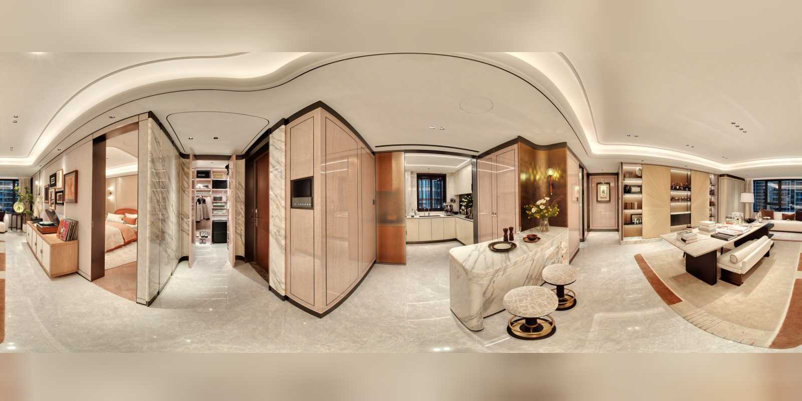
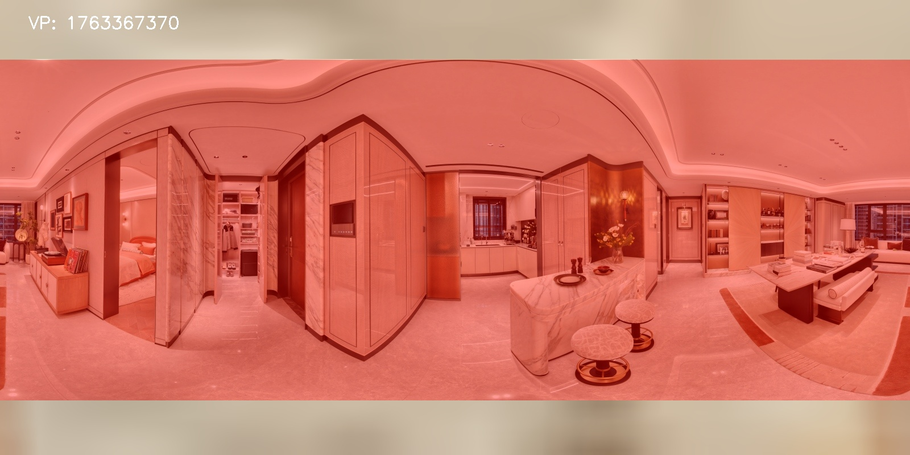
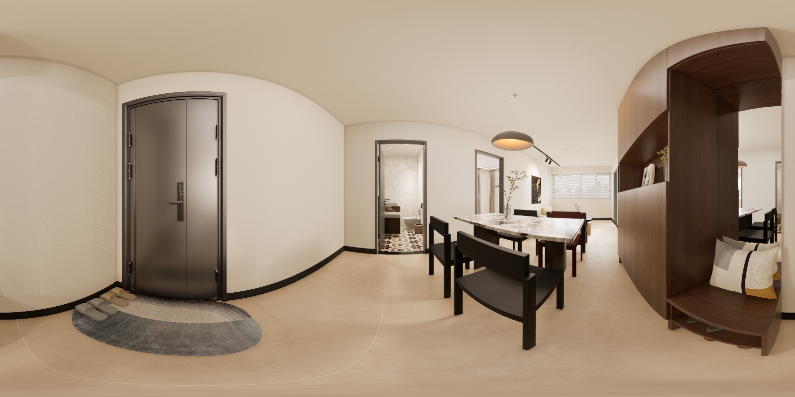
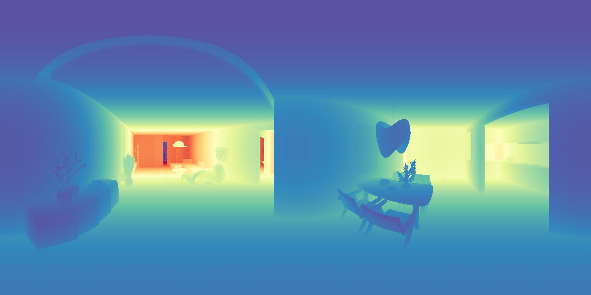
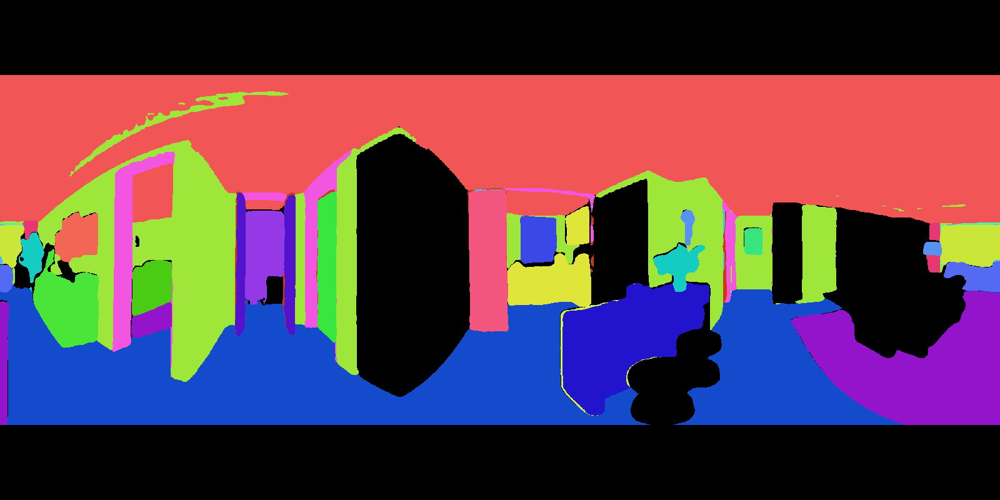
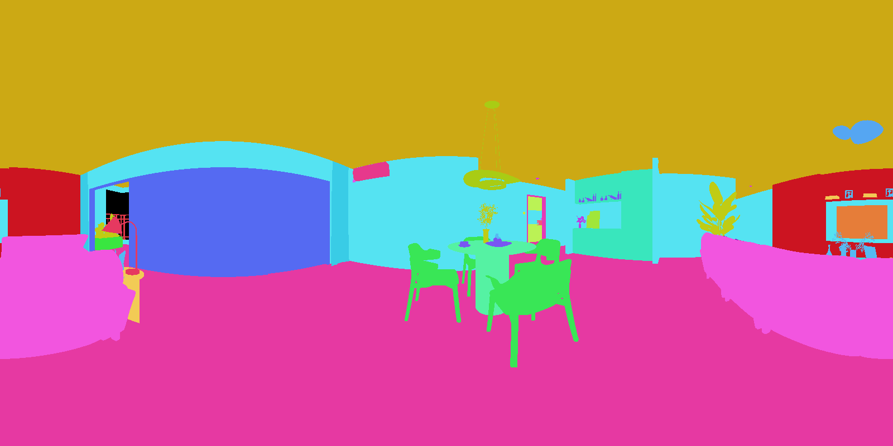

# 📂 Dataset Structure

The Realsee3D dataset adheres to a hierarchical file organization centered around unique scene identifiers. Each scene directory encapsulates the complete multi-view RGB-D data, comprising a registry of available viewpoints and a structured subdirectory containing sensor data and annotations for each distinct viewpoint.

## File Hierarchy

```text
scene_id/
├── viewpoints.txt       # Registry of all viewpoint IDs (timestamps) within the scene.
└── viewpoints/
    └── viewpoint_id/    # Container for specific viewpoint data.
        ├── panoImage_1600.jpg  # Equirectangular RGB Panorama (typically 1600x800).
        ├── depth_image.png     # 16-bit aligned relative depth map.
        ├── segment.png         # 8-bit single-channel semantic segmentation map (pixel value = class ID).
        ├── pano_mask.png       # [Real-world only] Validity mask indicating FOV blind spots.
        ├── extrinsics.txt      # 4x4 Camera-to-World transformation matrix.
        ├── depth_scale.txt     # Normalization factor for metric depth recovery.
        └── floor.txt           # Floor level index for multi-story environments.
```

## 1. Visual Representations

### RGB Panorama (`panoImage_1600.jpg`)
The primary visual modality is a high-resolution, 360° equirectangular panoramic image.

*   **Real-world Scenes**: These panoramas are synthesized from multiple high-definition fisheye images. Due to the vertical Field of View (FOV) constraints of the acquisition hardware, visual data is absent in the **zenith and nadir** (top and bottom) regions.
    *   **Validity Mask (`pano_mask.png`)**: To account for these blind spots, we provide a binary mask where valid pixels are marked, ensuring accurate processing of the visual field.
    *   *Visualization*:
        | Real-world RGB Panorama | Validity Mask (RED = Valid) |
        | :---: | :---: |
        |  |  |

*   **Procedurally Generated Scenes**: These panoramas are rendered directly by the engine with full spherical coverage. Consequently, they exhibit **no blind spots** and require no validity mask.
    *   *Visualization*:
        | Synthetic RGB Panorama |
        | :---: |
        |  |

### Depth Map (`depth_image.png`)
Depth information is encoded as a **16-bit single-channel PNG**, spatially aligned with the RGB panorama. Pixel values represent normalized relative depth.

*   **Real-world Data**: Obtained through LiDAR scanning, these depth maps are inherently **sparse**, a characteristic stemming from the discrete sampling principle of LiDAR technology.
    *   *Visualization*:
        | Real-world Depth (Sparse) |
        | :---: |
        |  |

*   **Procedurally Generated Data**: Generated via high-precision rendering, these depth maps are **dense** and continuous.
    *   *Visualization*:
        | Synthetic Depth (Dense) |
        | :---: |
        |  |

### Semantic Segmentation (`segment.png`)
Each viewpoint provides a pixel-wise semantic segmentation map, **spatially aligned** with the RGB panorama and depth map. It is encoded as an **8-bit single-channel PNG** at the same resolution as the panorama (1600×800), where **each pixel value is the integer class ID** of the category occupying that pixel. The label `0` is reserved for **background / unlabeled / invalid** regions (e.g. the zenith and nadir blind spots in real-world captures).

Because raw label values are small integers (0–209), the image appears almost black when opened directly; apply a color palette (see *Visualization* below) to inspect it.

> **⚠️ Important — real-world labels are model predictions, not ground truth.**
> For **real-world scenes**, the `segment.png` maps are produced by **our own trained segmentation model (inference results)**, not by manual annotation, so they may contain errors. **Synthetic scenes** carry exact labels rendered from the scene definition. Human-verified ground-truth annotations for the real-world subset are planned for a **future release**.

*   **Class taxonomies (real vs. synthetic)**: The two subsets use **different label spaces**, so the correct mapping table must be selected based on the scene type. Each table is a JSON file carrying the class names (English/Chinese) and an **official RGB colour palette** so segmentation maps render consistently across users (ID 0 → black). See [`metadata/README.md`](metadata/README.md) for the full JSON schema.
    *   **Real-world Scenes** → [`metadata/class_mapping_real.json`](metadata/class_mapping_real.json): 150 flat categories (IDs sparsely allocated in the range `1–197`), e.g. `1 = ceiling`, `2 = floor`, `3 = wall`. *(Labels are model predictions; see the note above.)*
    *   **Procedurally Generated Scenes** → [`metadata/class_mapping_synthetic.json`](metadata/class_mapping_synthetic.json): 209 categories (IDs `1–209`) organized as a **three-level taxonomy**. Each class exposes a `taxonomy` object with `level1` / `level2` / `level3` (deeper levels are `null`), e.g. `91 = basic/wall/wall_cloth` → `{level1: basic, level2: wall, level3: wall_cloth}`.

    The palette is fixed and deterministic — every class always maps to the same colour, and ID 0 (background) is always black.

*   **Decoding example**:
    ```python
    import cv2, json

    # Real-world scene → class_mapping_real.json ; synthetic scene → class_mapping_synthetic.json
    seg = cv2.imread("segment.png", cv2.IMREAD_UNCHANGED)  # (800, 1600) uint8, value = class ID
    mapping = json.load(open("metadata/class_mapping_real.json", encoding="utf-8"))
    id2name = {c["id"]: c["name"] for c in mapping["classes"]}
    present = [id2name.get(i, "background") for i in sorted(set(seg.flatten().tolist()))]
    ```

*   **Visualization**: Colour-mapped previews are shown below (see [Tools & Utilities](#3-tools--utilities) for the script that produces them):
    | Real-world Segmentation | Synthetic Segmentation |
    | :---: | :---: |
    |  |  |

## 2. Geometric & Spatial Metadata

### Depth Scale (`depth_scale.txt`)
This file contains a scalar value used to recover absolute metric depth (in meters) from the relative 16-bit integer depth values. The relationship is defined as:
`Depth (meters) = Pixel Value / Scale Factor`

### Extrinsics (`extrinsics.txt`)
This file provides the **Camera-to-World** transformation matrix ($4 \times 4$). It defines the precise 6-DoF pose of the camera within the global scene coordinate system. This matrix is fundamental for:
1.  **Back-projection**: Transforming local 3D points (reconstructed from depth maps) into the global frame.
2.  **Registration**: Stitching point clouds from multiple viewpoints to form a coherent, holistic scene reconstruction.

### Floor Information (`floor.txt`)
For complex, multi-story environments, this file specifies the **floor index** to which the viewpoint belongs. This annotation facilitates vertical semantic understanding and floor-level data separation.

## 3. Tools & Utilities

### Point Cloud Generation
We provide a utility script, [`scripts/generate_pcd.py`](scripts/generate_pcd.py), to reconstruct the complete colored scene point cloud by aggregating data from all viewpoints. This tool handles the projection of depth maps to 3D space using the implied spherical intrinsics and the provided extrinsics.

**Usage**:
```bash
python scripts/generate_pcd.py --source <path_to_scene_dir> --output <output_dir> [--save_individual]
```

*   `--source`: Path to the organized data directory for a specific scene (e.g., `scene_sample`).
*   `--output`: Destination directory for the generated `.ply` point cloud files.
*   `--save_individual`: Optional flag to output separate point clouds for each viewpoint in addition to the merged scene.

### Segmentation Visualization
We provide a helper script, [`scripts/visualize_segmentation.py`](scripts/visualize_segmentation.py), that colourises a `segment.png` with the official palette (ID 0 stays black) and can optionally blend it over the RGB panorama.

**Usage**:
```bash
python scripts/visualize_segmentation.py \
    --segment <viewpoint>/segment.png \
    --mapping metadata/class_mapping_real.json \
    --panorama <viewpoint>/panoImage_1600.jpg --alpha 0.6 \
    --output seg_vis.png
```

*   `--segment`: Path to the `segment.png` to visualize.
*   `--mapping`: Class-mapping JSON — `metadata/class_mapping_real.json` for real-world scenes, `metadata/class_mapping_synthetic.json` for synthetic scenes.
*   `--output`: Destination path for the colourised PNG.
*   `--panorama`: Optional `panoImage_1600.jpg` to blend the segmentation over.
*   `--alpha`: Optional segmentation opacity for the overlay (0–1, default `0.6`).
*   `--legend`: Optional flag to print the classes present in the image.
