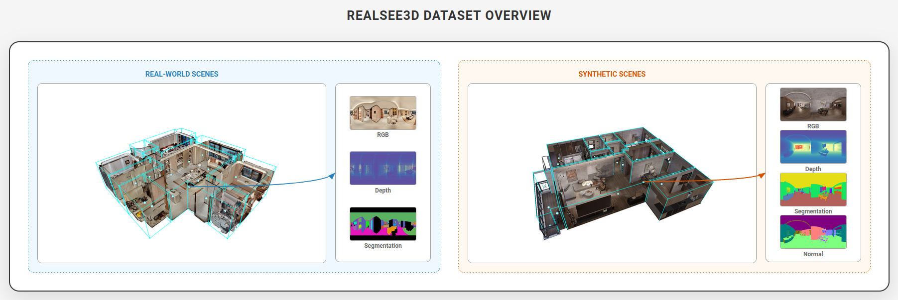

# 📘 Realsee3D Dataset



[](https://yourname.github.io/Realsee3D)
[](https://yourname.github.io/Realsee3D)
[](https://yourname.github.io/Realsee3D)

Realsee3D is a large-scale, multi-view RGB-D dataset containing 10,000 indoor scenes, comprising real-world residential scenes captured by 3D LiDAR Camera and procedurally generated scenes.

## ✨ Features

*   **Large Scale:** 10,000 unique indoor scenes.
*   **Rich Data:** Panoramic RGB-D captures with complete room-level coverage.
*   **Comprehensive Annotations:** Includes CAD drawings, floor plans, semantic segmentation, 3D detection labels and more (forthcoming).
*   **Diverse Scenes:** Comprising 1,000 real-world scenes with varied layouts and decoration styles, and 9,000 procedurally generated scenes utilizing over 100 designer-curated style templates, ensuring diverse furniture models and styles for robust training and testing.

## 🗃️ Data Organization

The Realsee3D dataset is organized into individual scenes, each containing detailed multi-view RGB-D data. To access and understand the data, please refer to the following resources:

*   **Detailed Dataset Structure:** [DATASET_STRUCTURE.md](DATASET_STRUCTURE.md) provides a comprehensive explanation of the file organization and data formats within each scene.
*   **Download and Usage Instructions:** For information on how to download the dataset and begin using it, please visit our [official website](https://yourname.github.io/Realsee3D).

## 📊 Statistics

For a detailed breakdown of dataset statistics, please refer to [metadata/README.md](metadata/README.md).

## 📄 Citation

If you use the Realsee3D dataset in your research, please cite our paper:

```
@inproceedings{linyuan2026realsee3d,
  title={Realsee3D: A Large-Scale Multi-View RGB-D Dataset of Indoor Scenes},
  author={Linyuan Li, et al.},
  booktitle={},
  year={2026}
}
```

## 📝 License

The Realsee3D dataset is licensed under the [Creative Commons Attribution-NonCommercial-ShareAlike 4.0 International License](https://creativecommons.org/licenses/by-nc-sa/4.0/).

---

For more information, including full dataset introduction, statistics, and abstract, please visit our [project website](https://yourname.github.io/Realsee3D).
