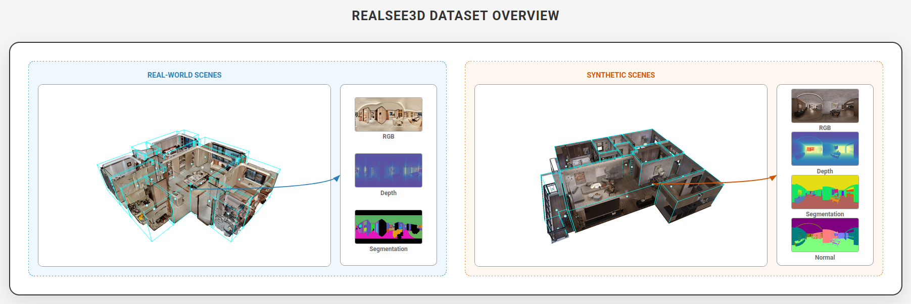

# 📘 Realsee3D Dataset



[](https://dataset.realsee.ai/)
[](https://https://dataset.realsee.ai/#download)

Realsee3D is a large-scale, multi-view RGB-D dataset containing 10,000 indoor scenes, comprising real-world residential scenes captured by 3D LiDAR Camera and procedurally generated scenes.

## ✨ Features

*   **Large Scale:** 10,000 unique indoor scenes, comprising 95,962 rooms and 299,073 viewpoints/RGB-D pairs.
*   **Rich Data:** Panoramic RGB-D captures with complete room-level coverage.
*   **Comprehensive Annotations:** Includes pixel-wise semantic segmentation (available for both real-world and synthetic scenes), with CAD drawings, floor plans, 3D detection labels and more (forthcoming).
*   **Diverse Scenes:** Comprising 1,000 real-world scenes with varied layouts and decoration styles, and 9,000 procedurally generated scenes utilizing over 100 designer-curated style templates, ensuring diverse furniture models and styles for robust training and testing.

## 🗃️ Data Organization & Access

The Realsee3D dataset is organized into individual scenes, each containing detailed multi-view RGB-D data.

*   **Data Structure & Usage:** [DATASET_STRUCTURE.md](DATASET_STRUCTURE.md) provides a comprehensive explanation of the file organization, data formats, and detailed usage instructions.
*   **Methodology:** Visit our [official website](https://dataset.realsee.ai/) for more detailed information on how real-world data is collected and how synthetic data is generated.

### 📥 How to Download

To access the dataset, you must sign a Data Usage Agreement (PDF format). You can download the agreement directly [here](docs/Realsee3D_Dataset_agreement.pdf).
Please send your request, specifying your intended use, to **developer@realsee.com** with the subject **[Realsee3D Dataset Application]**. Once your application is approved and you have signed the agreement, we will reply with download instructions and links.

> **Already have Phase I access?** You do **not** need to submit a new agreement. Simply forward your previous approval email to **developer@realsee.com**, including a Google-Drive-accessible email address, and we will grant you download access to the Phase II data directly.


## 📊 Statistics

For a detailed breakdown of dataset statistics, please refer to [metadata/README.md](metadata/README.md).

## 📋 Changelog

*   **2026-07-01:** Our new work [**Argus**](https://argus-paper.realsee.ai/) — a metric panoramic 3D reconstruction method trained on Realsee3D (ECCV 2026) — is now released. The covisibility score matrix data used by Argus is now available in Realsee3D. See [DATASET_STRUCTURE.md](DATASET_STRUCTURE.md) for more details.
*   **2026-06-25:** Phase II data released — per-viewpoint pixel-wise semantic segmentation (`segment.png`) for both real-world and synthetic scenes. Real-world maps are current-model predictions (not manual annotation); ground-truth annotations are planned for a future release. See [DATASET_STRUCTURE.md](DATASET_STRUCTURE.md) for details.
*   **2025-12-05:** Phase I data(RGB-D pano and extrinsics) released.
*   **2025-11-28:** Dataset introduction and official website release.

## 🔬 Built with Realsee3D

**Argus: Metric Panoramic 3D Reconstruction for Indoor Scenes** *(ECCV 2026)*

Argus is a data-driven feed-forward network trained on Realsee3D that reconstructs complete, geometrically consistent, metric-scale indoor 3D scenes from sparse, unordered panoramic images in a single forward pass. Argus achieves state-of-the-art metric performance on camera pose estimation, depth estimation, and point cloud reconstruction on the Realsee3D benchmark, demonstrating the value and usability of the dataset for panoramic 3D reconstruction research.

*   **Project Page:** https://argus-paper.realsee.ai/
*   **Paper:** [arXiv:2606.30047](https://arxiv.org/abs/2606.30047)
*   **Code:** [github.com/realsee-developer/Argus](https://github.com/realsee-developer/Argus)
*   **Model:** [RealseeTechnology/argus-realsee3d](https://huggingface.co/RealseeTechnology/argus-realsee3d)
*   **Demo:** [RealseeDeveloper/Argus](https://huggingface.co/spaces/RealseeDeveloper/Argus)

> Building on Realsee3D? Feel free to open a PR/issue to have your work listed here.

## 📄 Citation

If you use the Realsee3D dataset in your research, please cite our paper:

```
@misc{Li2025realsee3d_data,
  doi = {10.5281/zenodo.17826242},
  url = {https://doi.org/10.5281/zenodo.17826242},
  author = {Li, Linyuan and Wu, Yan and Li, Xi and Wang, Lingli and Rao, Tong and Zhou, Jie and Pan, Cihui and Hui, Xinchen},
  title = {Realsee3D: A Large-Scale Multi-View RGB-D Dataset of Indoor Scenes (Version 1.1)},
  publisher = {Zenodo},
  year = {2026}
}
```

```
@misc{li2026argusmetricpanoramic3d,
  title={Argus: Metric Panoramic 3D Reconstruction for Indoor Scenes},
  author={Xi Li and Linyuan Li and Yan Wu and Tong Rao and Kai Zhang and Xinchen Hui and Cihui Pan},
  year={2026},
  eprint={2606.30047},
  archivePrefix={arXiv},
  primaryClass={cs.CV},
  url={https://arxiv.org/abs/2606.30047}
}
```

## 📝 License

### Code License

The accompanying code for data parsing, visualization, and evaluation is released under the [MIT License](https://opensource.org/licenses/MIT), allowing for free use, modification, and distribution.

